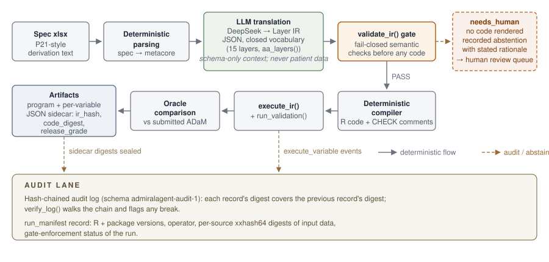

```{r setup, include = FALSE}
knitr::opts_chunk$set(collapse = TRUE, comment = "#>", eval = FALSE)
```

The [CDISC pilot 5 showcase](cdisc-pilot-showcase.html) reports aggregate
numbers: how many variables automated, how many abstained, how many matched
the oracle. This article opens the black box on three individual derivations
from the same run and follows each one through the full chain — spec text,
Layer IR, gate result, rendered code, execution status, oracle number. Every
quote below is verbatim from a machine file under `demo/automation/out/` (or
from the package sources, where cited). Nothing is paraphrased from memory.

The reason the chain is worth dissecting at all: **the LLM never writes
code.** DeepSeek only translates spec free text into the closed-vocabulary
Layer IR (JSON; 15 layers, registered in `R/layers.R` `aa_layers()`), and
`build_context()` sends schema-level spec text only — never patient data. A
fail-closed semantic gate (`validate_ir()`) checks the IR, and a deterministic
compiler renders the `{admiral}` code from it. The review surface is
therefore the IR plus its deterministic projection, not a language model's
free-form output.

{width=100%}

## Case 1 — ITTFL: the full happy path

ITTFL (Intent-To-Treat Population Flag) is the variable the showcase calls
out as the one end-to-end conversion delivered by the newest layer,
`assign_conditional`. Here is the whole chain.

**Spec text.** The derivation column of the P21-style spec
(`out/spec_adsl.csv`, ADSL/ITTFL row, also cached in `out/spec_adsl.rds`):

```text
Y if ARMCD ne ' '. N otherwise
```

**Layer IR.** What DeepSeek translated it into, verbatim from
`out/ir_llm.rds` (printed as JSON):

```json
[{"dataset":"ADSL","variable":"ITTFL","steps":[{"layer":"assign_conditional","args":{"target":"ITTFL","condition":"ARMCD != ' '","true_value":"Y","else_value":"N"}}],"spec_origin":"Y if ARMCD ne ' '. N otherwise","confidence":0.85,"needs_human":false,"rationale":"Y where ARMCD is non-blank, N otherwise; ARMCD is present in ADSL from dm base. Condition uses comparison against a blank string literal."}]
```

One step, one closed-vocabulary layer, explicit confidence, and a rationale
that explains the semantics the translator chose. Note that the IR is
*semantic*, not textual: `ARMCD != ' '` is a gate-validated condition
expression, not an arbitrary string the model made up.

**Gate.** `validate_ir()` accepted the chain — `out/gate_report.json` records
`"gate": "PASS"` for the ADSL/llm backend.

**Rendered code.** The deterministic compiler's output, verbatim from the
artifact `out/artifacts/llm/adsl__ittfl__496bd0eb.R` — every line, including
every comment:

```r
# DISCLAIMER: DRAFT CODE - qualified human review required before use.
# ---- ITTFL | step 1/1: assign_conditional ----
# Spec origin: "Y if ARMCD ne ' '. N otherwise"
# Agent rationale: Y where ARMCD is non-blank, N otherwise; ARMCD is present in ADSL from dm base. Condition uses comparison against a blank string literal.
# Confidence: 0.85
# CHECK: flag variable should be set for at least some records (not all-NA, not all-set)
# CHECK: derived values must be a subset of the spec codelist (verify vs metacore)
ADSL <- ADSL |>
  dplyr::mutate(ITTFL = dplyr::case_when(
    ARMCD != ' ' ~ "Y",
    TRUE ~ "N"
  ))
# CHECK: human must confirm the condition semantics and the else branch (NA vs "") before use
```

The code carries its provenance in-band: the spec text it came from, the
agent's rationale, the confidence, and three CHECK comments telling the
reviewer exactly what a machine could not confirm. The reviewer reads 13
lines, not a diff against a mystery.

**Execution and oracle.** `out/exec_status_llm.csv` records
`"ITTFL","EXECUTED"`; `out/validation_llm.csv` records the automated
`flag_rate` check as PASS (the codelist check is, by design, `MANUAL` —
"compare against spec codelist"). The oracle comparison,
`out/accuracy_llm.csv`:

```text
"ITTFL","compared",100,NA,254,"na_agree=1.00"
```

One hundred percent value agreement on the 254 joined subjects. Spec text in,
oracle-aligned executable derivation out, with a full evidence trail between
them.

## Case 2 — SAFFL: fail-closed abstention

SAFFL (Safety Population Flag) is the same kind of variable, one idea harder.
Its spec text (`out/spec_adsl.csv`, ADSL/SAFFL row):

```text
Y if ITTFL='Y' and TRTSDT ne missing. N otherwise
```

The IR the LLM returned (`out/ir_llm.rds`):

```json
{"dataset":"ADSL","variable":"SAFFL","steps":[],"spec_origin":"Y if ITTFL='Y' and TRTSDT ne missing. N otherwise","confidence":0.3,"needs_human":true,"rationale":"Condition requires a missingness check (TRTSDT ne missing) and setting 'N' otherwise; the filter sublanguage cannot express is.na()-style missingness checks, so this must be routed to human review."}
```

`steps` is empty. The translator recognised that the derivation needs an
`is.na()`-style missingness check, that the closed filter sublanguage cannot
express one, and said so — with confidence 0.3 and a stated reason. No code
is rendered. Downstream, `out/exec_status_llm.csv` records
`"SAFFL","REVIEW","needs human decision"`, `out/validation_llm.csv` records
`needs_human / MANUAL / "routed to human review"`, and
`out/accuracy_llm.csv` records `"SAFFL","not_produced"`.

An abstention is not a failure; it is a queue entry with the decision the
human has to make spelled out in the rationale. The alternative is guessing —
and the showcase's free-form comparison arm shows what guessing looks like.
In that arm the same model, writing R directly, happily generated SAFFL code:
18 lines for a variable the constrained pipeline refused to touch. It ERRORed
at execution (`out/compare_exec_status.csv`: `! object 'ITTFL' not found`) —
loud, that time. But for the sibling variable VISNUMEN the free-form arm
silently executed and produced values with **0% oracle agreement**
(`out/compare_summary.json`, `freeform.silent_error_variables` /
`silent_error_detail`: `"variable": "VISNUMEN", "value_agree": 0`) — the
constrained IR abstained on it instead. The full arm-vs-arm analysis is in
the [IR vs free-form article](ir-vs-freeform.html).

Fail-closed is not the absence of output. It is recorded, reasoned refusal.

## Case 3 — the renamed-column gate (finding F-01)

The third case is a mistake the system used to make — and now catches before
any code exists. In an earlier showcase run the LLM produced this two-step
chain for TRTSDT: merge `SVSTDTC` from SV onto ADSL under the new name
`TRTSDT`, then impute the date from... `SVSTDTC`, the old name that no longer
exists on ADSL. Before F-01 was fixed, that chain passed validation and
exploded only at execution. The regression fixture now lives in
`tests/testthat/test-renamed-columns.R`:

```r
# The verbatim F-01 chain from the pilot5 showcase: SVSTDTC is merged onto ADSL
# as TRTSDT, then impute_dtc still points at SVSTDTC on ADSL.
f01_ir <- function() {
  list(new_variable_ir("ADSL", "TRTSDT", list(
    new_step("merge_var", list(
      target = "TRTSDT", source = "SVSTDTC", dataset_add = "sv",
      by_vars = c("STUDYID", "USUBJID"), order = "SVSTDTC", mode = "first",
      filter = "VISITNUM == 3"
    )),
    new_step("impute_dtc", list(
      target = "TRTSDT", dtc = "SVSTDTC", output_class = "dt",
      highest_imputation = "D", date_imputation = "first"
    ))
  )))
}
```

`validate_ir()` now tracks merge renames across steps and rejects the chain
at the gate. The verbatim problem message (`R/ir.R`, format string applied to
this fixture):

```text
[TRTSDT step 2] references column 'SVSTDTC' on dataset ADSL, but an earlier merge brought that column in as 'TRTSDT'; reference the new name
```

Three things to note about that message. It fires **before** any code is
rendered or run — the fail-closed line moved from the execution layer into
the semantic gate. It names both the old and the new column, so the fix is a
one-word edit. And it is pinned by an executable regression,
`tests/testthat/test-renamed-columns.R`, which also pins the legitimate cases
(referencing the new name, self-merges, re-reading the old name from the
*source* dataset, cross-variable references).

Contrast this with free-form code generation. There, the equivalent class of
mistake either explodes at runtime — loud, acceptable — or, in the worse
variants like wrong filter logic, passes silently and produces wrong values
with no signal at all. The ir-vs-freeform comparison measured 4 such silent
wrong answers in the free-form arm across 49 spec variables
(`out/compare_summary.json`: `freeform.silent_errors: 4`, vs the constrained
arm whose 4 mechanically-flagged "silents" are all the documented F-05 oracle
rounding family). Catching a bad reference at the gate with a naming hint is
what that difference looks like at the level of one derivation.

## What the artifacts remember

Every rendered program carries a JSON sidecar, and every execution appends to
a hash-chained audit log. Both are quoted here verbatim (long digests trimmed
with `…`).

**The sidecar** `out/artifacts/llm/adsl__ittfl__496bd0eb.R.json`:

```json
{
  "artifact": "adsl__ittfl__496bd0eb.R",
  "package_version": "0.1.0",
  "backend": "llm-deepseek",
  "model": "deepseek-chat",
  "ir": [ { "dataset": "ADSL", "variable": "ITTFL", "steps": [ … ],
      "spec_origin": "Y if ARMCD ne ' '. N otherwise", "confidence": 0.85,
      "needs_human": false, "rationale": "…" } ],
  "ir_hash": "fd9bb37a",
  "code_digest": "11941647bde6654315af0e04e929d73a088aae3fd641751cb5063e4d9439ab4f",
  "gate": null,
  "release_grade": "ungated-draft",
  "gate_enforced": null,
  "validation": null,
  "created_at": "2026-10-01T20:05:15-0400",
  "disclaimer": "DRAFT generated code; human review required before regulated use"
}
```

The sidecar embeds the IR itself, plus two digests. `ir_hash` is computed
over the canonical IR — so editing the sidecar afterwards (flipping
`needs_human` to `false`, say) breaks the seal: `read_artifact()` rejects an
artifact whose embedded IR no longer hashes to `ir_hash`. `code_digest`
binds the rendered code to the same record. The artifact self-labels its
release grade: `"ungated-draft"`, with the matching disclaimer, because the
showcase is an unattended run written with `require_gate = FALSE` — an
explicit, recorded opt-out, stated in `out/gate_report.json`:

```text
"gate_policy": "Package default is gate-required. Programs here are written with require_gate = FALSE (explicit opt-out, no human approver in an unattended showcase). They are permanently self-labelled UNGATED DRAFT and never release-grade."
```

**The audit log.** First record of `out/execute_llm.jsonl`:

```json
{"schema":"admiralagent-audit-1","seq":1,"time":"2026-10-01T20:05:46-0400","package_version":"0.1.0","event":"execute_variable","details":{"run_id":"run683c28ad5b09","dataset":"ADSL","variable":"STUDYID","status":"EXECUTED","layers":"assign","note":""},"prev":"0000000000000000000000000000000000000000000000000000000000000000","mode":"sha256","digest":"198b0e72485dc9c3da3a0b3ba7b26e17fce3757a8a8ad0eaa53148c99022fed4"}
```

`prev` is all zeros on the genesis record; every later record's `digest`
covers its own content *and* the previous record's digest, so deleting or
rewriting any record breaks the chain from that point on — `verify_log()`
walks the chain and says so. The same log closes with a `run_manifest`
record (seq 50) that pins the environment and the inputs: R version, package
versions, operator, and per-source xxhash64 digests and shapes of the SDTM
data that fed the run:

```json
{"schema":"admiralagent-audit-1","seq":50,"event":"run_manifest","details":{"manifest_schema":"admiralagent-manifest-1","run_id":"run683c28ad5b09","r_version":"R version 4.6.0 (2026-04-24 ucrt)","packages":{"admiral":"1.5.0.9011","metatools":"0.3.0","dplyr":"1.2.1","rlang":"1.3.0"},…,"source_data":[{"source":"base","rows":306,"cols":25,"columns":[…],"digest":"xxhash64:6aeb909cce25d84b"},{"source":"dm",…,"digest":"xxhash64:6aeb909cce25d84b"},{"source":"ex",…,"digest":"xxhash64:011a6b5c369aa767"},{"source":"vs",…,"digest":"xxhash64:64dad7bc779481b8"},…],…,"gate_enforced":false,…}}
```

Re-run the pipeline on tampered source data and the manifest digests change;
the provenance of what the oracle number was computed against is part of the
record, along with the gate-enforcement status of the run.

**What is actually being archived.** This is the design point that ties the
three cases together (`DESIGN.md` §6, security model, point 7 — translated):
the audited, signed, archived artifact is **the IR itself** — not the
generated code, and not the LLM's trajectory. The LLM never writes R code;
the code is a deterministic projection of the IR, so the same IR always
projects to the same code (`code_digest` above). There is no need to archive
prompts, temperatures, or trajectories to explain a derivation: the IR, its
`spec_origin`, its rationale, and its hash *are* the explanation.

## What this buys in a GxP context — and what it does not

For a regulated workflow the practical consequences are:

- **The review surface is small and structured.** A reviewer reads the IR
  (closed vocabulary, one page of JSON per variable) plus the rendered code
  with its CHECK comments, instead of auditing free-form LLM output. Case 1's
  entire program is 13 lines, three of which tell the human what to verify.
- **Every refusal is recorded.** Case 2's abstention is a first-class,
  reasoned queue entry — visible in the gate report, the execution status,
  the validation table, and the accuracy file — not an omission you have to
  notice.
- **Every artifact self-labels.** Release grade, gate-enforcement status,
  backend, model, IR hash, and code digest travel with the code; tampering
  with the record invalidates it, and the hash-chained audit log plus
  run manifest make the execution itself replayable and checkable.

And the honest limits, unchanged from the showcase: everything here is a
single model (DeepSeek `deepseek-chat`), a single study (pilot5 ADSL), and
one stochastic run — `REPORT.md` limitation 8 states verbatim: *"Single
model, three datasets, and stochastic. Numbers are for DeepSeek
`deepseek-chat` on pilot5 ADSL/ADAE/ADLBC only; they do not transfer to other
models or datasets without re-measurement."* Abstention counts are
run-variable. Oracle agreement is not double programming. And the showcase
programs are ungated drafts by explicit opt-out — demonstration output, not
release-grade deliverables.

## See also

- [CDISC Pilot 5 Automation Showcase](cdisc-pilot-showcase.html) — the
  aggregate numbers and limitations for the run these cases come from.
- [Constrained IR vs free-form code generation](ir-vs-freeform.html) — the
  controlled arm-vs-arm experiment.
- The package repository, including `demo/automation/` with all cited
  machine files: <https://github.com/yanmingyu92/admiralagent>
